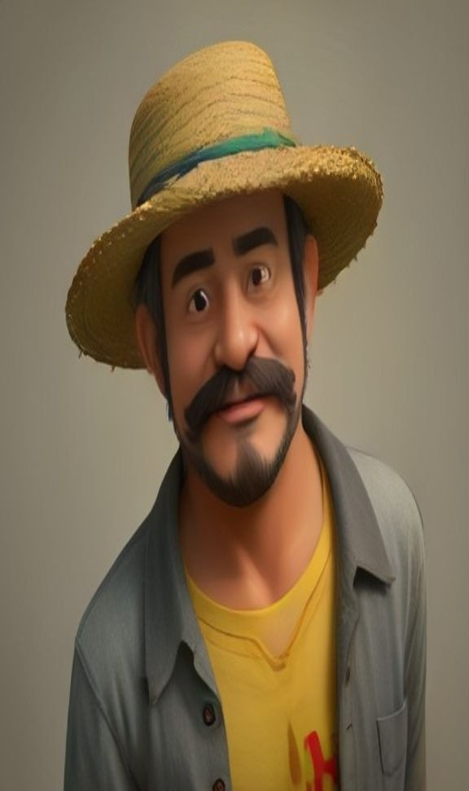

<div align="center">



# tiktok-ai-bot

Geracao e publicacao diaria de esquetes de humor com IA, estreladas por um personagem 3D fixo e original, para TikTok e YouTube Shorts.

[](https://www.python.org/)
[](https://developers.tiktok.com/)
[](https://developers.google.com/youtube/v3)
[](https://groq.com/)
[](https://github.com/features/actions)

</div>

---

## Indice

- [Visao geral](#visao-geral)
- [Como funciona](#como-funciona)
- [Sobre monetizacao](#sobre-monetizacao-tiktok-creator-rewards-program)
- [Limitacao importante do TikTok](#limitacao-importante-do-tiktok)
- [Setup passo a passo](#setup-passo-a-passo)
- [Customizacao](#customizacao)
- [Rodando localmente](#rodando-localmente)

## Visao geral

Este bot gera uma esquete de humor por dia e publica automaticamente no **TikTok** e no **YouTube Shorts**, usando as **APIs oficiais** de cada plataforma via GitHub Actions (cron diario).

Ele nao usa scraping nem automacao de navegador: esse tipo de tecnica viola os Termos de Servico das plataformas e coloca a conta em risco de banimento.

## Como funciona

| Etapa | Ferramenta | Funcao |
|---|---|---|
| 1 | [Pollinations.ai](https://pollinations.ai/) (gratuito, uma unica vez) | Gera e cacheia a imagem do personagem fixo |
| 2 | [Groq](https://groq.com/) (LLM gratuito) | Escreve o roteiro: monologo do personagem, legenda e hashtags |
| 3 | [edge-tts](https://github.com/rany2/edge-tts) (gratuito) | Narra o roteiro e retorna o timing de cada palavra |
| 4 | MoviePy / ffmpeg | Monta o video: personagem com zoom leve, legendas animadas palavra a palavra e risada final |
| 5 | TikTok Content Posting API | Publica no TikTok |
| 6 | YouTube Data API v3 | Publica no YouTube Shorts |

A mesma imagem do personagem (gerada uma unica vez e commitada em `assets/character.png`) e reaproveitada em todo video, para manter sempre a mesma aparencia. O video final e enviado para as duas plataformas de forma independente: os liga/desliga sao `tiktok.enabled` e `youtube.enabled` em `config.yaml`. Se uma plataforma falhar ou nao estiver configurada, a outra continua normalmente.

### Por que sem lip-sync (boca sincronizada)?

Assim o projeto se mantem 100% gratuito. Um avatar com a boca sincronizada com a voz exige servicos pagos (HeyGen, D-ID, Synthesia). Ha tambem um motivo de regras: a politica do **TikTok Creator Rewards Program** exclui explicitamente "conteudo com sincronizacao labial" da definicao de conteudo original elegivel para monetizacao. O formato atual (narracao mais legenda, sem lip-sync) e o que melhor se encaixa nas regras vigentes.

## Sobre monetizacao (TikTok Creator Rewards Program)

Vale saber antes de esperar renda do bot:

- E preciso ter conta pessoal, 18 anos ou mais, **10.000 seguidores** e **100.000 visualizacoes nos ultimos 30 dias** apenas para se inscrever no programa.
- O video precisa ter **pelo menos 1 minuto**: por isso o roteiro foi ajustado para narracoes de 170 a 220 palavras.
- Conteudo de IA nao e proibido, mas precisa contar como "original": nada de copiar conteudo de terceiros, usar watermark de outro app ou apenas sobrepor texto em foto/video alheio. O TikTok tambem pede para rotular conteudo gerado por IA (em Configuracoes do video, opcao "Rotular como IA" no app; a Content Posting API ainda nao expoe esse campo).
- O YouTube tem um programa equivalente (YouTube Partner Program), com seus proprios requisitos de inscritos e horas assistidas, nao detalhados aqui.

## Limitacao importante do TikTok

Apps **nao auditados** pela TikTok so podem publicar com `privacy_level = SELF_ONLY`: o video fica visivel apenas para a propria conta, como um rascunho, e nao aparece publicamente no feed. Para publicar direto ao publico (`PUBLIC_TO_EVERYONE`), e necessario solicitar auditoria do app no TikTok for Developers depois que ele estiver funcionando (Manage Apps > seu app > Submit for Review). Essa e uma exigencia da TikTok, nao uma limitacao deste bot.

O YouTube Shorts nao tem essa restricao: com o app OAuth do Google em publishing status **"In production"**, os videos ja saem publicos direto (configuravel em `youtube.privacy_status`).

O Kwai nao foi incluido porque a Kuaishou/Kwai nao oferece API publica de postagem para desenvolvedores individuais fora de parcerias comerciais/MCN.

## Setup passo a passo

### 1. Crie o repositorio no GitHub

Suba esta pasta para um repositorio novo (pode ser privado).

### 2. Ative o GitHub Pages (necessario para o OAuth do TikTok)

O TikTok exige `redirect_uri` em HTTPS (nao aceita `localhost`). Este repo ja inclui `docs/oauth-callback.html` pronto para isso.

- Settings > Pages > Source: `Deploy from a branch` > Branch: `main` / `docs`
- Sua URL de callback sera algo como: `https://SEU-USUARIO.github.io/SEU-REPO/oauth-callback.html`

### 3. Crie a chave gratuita da Groq

- Acesse [console.groq.com/keys](https://console.groq.com/keys) e clique em Create API Key
- Guarde o valor como `GROQ_API_KEY`

### 4. Gere a imagem do personagem (uma vez, e commite no repo)

```bash
pip install -r requirements.txt
python -m src.generate_character
git add assets/character.png
git commit -m "Gera personagem do canal"
git push
```

Isso fixa a aparencia do personagem definitivamente (o gerador de imagens gratuito nao repete o mesmo rosto sozinho a cada chamada). Para trocar o visual, edite `character.description` em `config.yaml` e rode novamente com `--force`.

### 5. Crie o app no TikTok for Developers

- Acesse [developers.tiktok.com/apps](https://developers.tiktok.com/apps) e clique em Create app
- Adicione o produto **Content Posting API** (e **Login Kit**)
- Em Login Kit > Redirect URI, cadastre a URL do passo 2
- Anote `Client key` e `Client secret`

### 6. Gere o primeiro refresh token (roda uma unica vez, na sua maquina)

```bash
python -m src.oauth_setup
```

O script pede `TIKTOK_CLIENT_KEY`, `TIKTOK_CLIENT_SECRET` e o `redirect_uri` do passo 2, abre a URL de autorizacao (voce faz login com a conta do TikTok que vai postar) e pede que voce cole o `code` que aparece na pagina de callback. No final ele imprime o `TIKTOK_REFRESH_TOKEN`.

### 7. Crie um GitHub Personal Access Token

Esse token permite que o bot atualize sozinho o token do TikTok. O `refresh_token` do TikTok pode mudar a cada renovacao; para o bot continuar funcionando sem intervencao manual toda semana, ele atualiza o secret sozinho via API do GitHub (o refresh_token do YouTube nao precisa disso, pois o Google nao o rotaciona a cada uso).

- GitHub > Settings > Developer settings > Personal access tokens (classic)
- Escopo: `repo`
- Guarde o valor como `GH_PAT`

### 8. Crie o projeto no Google Cloud e o app do YouTube

- Acesse [console.cloud.google.com](https://console.cloud.google.com/) e crie um projeto novo
- Em APIs e servicos > Biblioteca, ative **"YouTube Data API v3"**
- Em APIs e servicos > Tela de consentimento OAuth:
  - Tipo de usuario: **External**
  - Escopo adicionado: `https://www.googleapis.com/auth/youtube.upload`
  - Publique o app (botao "Publish app", mudando de "Testing" para "In production"). Isso e essencial: em "Testing" o refresh_token expira em 7 dias e o bot para de funcionar sozinho.
  - Como o escopo `youtube.upload` e sensivel, o Google pode mostrar um aviso de "app nao verificado" para quem faz login. Isso e normal para uso pessoal: basta clicar em Avancado > Acessar mesmo assim (voce mesmo e quem loga).
- Em APIs e servicos > Credenciais > Criar credenciais > ID do cliente OAuth, escolha o tipo **"App para computador" (Desktop app)**
- Anote o `Client ID` e o `Client secret`

### 9. Gere o refresh token do YouTube (roda uma unica vez, na sua maquina)

```bash
python -m src.youtube_oauth_setup
```

O script abre o navegador para voce fazer login com a conta do YouTube que vai receber os Shorts, e no final imprime o `YOUTUBE_REFRESH_TOKEN`.

### 10. Cadastre os Secrets no repositorio

Em Settings > Secrets and variables > Actions > New repository secret:

| Nome | Valor |
|---|---|
| `GROQ_API_KEY` | do passo 3 |
| `TIKTOK_CLIENT_KEY` | do passo 5 |
| `TIKTOK_CLIENT_SECRET` | do passo 5 |
| `TIKTOK_REFRESH_TOKEN` | do passo 6 |
| `GH_PAT` | do passo 7 |
| `YOUTUBE_CLIENT_ID` | do passo 8 |
| `YOUTUBE_CLIENT_SECRET` | do passo 8 |
| `YOUTUBE_REFRESH_TOKEN` | do passo 9 |

Para usar apenas uma das duas plataformas, deixe os secrets da outra vazios e desative-a em `config.yaml` (`tiktok.enabled: false` ou `youtube.enabled: false`).

### 11. Teste manualmente antes de deixar no automatico

Em Actions > Daily AI video post > Run workflow, rode primeiro com `dry_run: true` (gera o video mas nao publica em nenhuma plataforma) e confira o artifact `video-*` gerado. Depois rode com `dry_run: false` para publicar de verdade (o TikTok recebe o video como privado/SELF_ONLY; o YouTube sai publico).

O cron ja esta configurado para rodar todo dia as 10h no horario de Brasilia.

## Customizacao

| Opcao | Efeito |
|---|---|
| `character.name` / `character.description` | Definem o personagem. Rode `python -m src.generate_character --force` depois de mudar a descricao |
| `niche` | Define o tipo de causo/piada |
| `tts_voice` | Escolhe a voz do TTS (rode `edge-tts --list-voices` para ver as opcoes) |
| `hashtags_extra` | Hashtags fixas adicionadas em todo video |
| `tiktok.enabled` / `youtube.enabled` | Liga/desliga cada plataforma |
| `captions.words_per_chunk` | Controla quantas palavras aparecem por vez na legenda animada |
| `video.zoom_effect` | Liga/desliga o efeito de zoom (Ken Burns) |
| `sfx.laugh_enabled` / `sfx.laugh_gap_seconds` | Adiciona uma risada de grupo apos o fim da narracao, escolhida aleatoriamente entre os arquivos em `assets/laughs/` (licenca livre do Mixkit). Adicione seus proprios mp3 nessa pasta para variar o efeito |
| `src/script_gen.py` | Ajusta o prompt do roteiro: tom, formato, idioma |

Depois que o app for auditado pela TikTok, altere `tiktok.privacy_level` em `config.yaml` para `PUBLIC_TO_EVERYONE`.

## Rodando localmente

```bash
cp .env.example .env   # preencha os valores
pip install -r requirements.txt
export $(cat .env | xargs)   # ou use python-dotenv / direnv
DRY_RUN=true python main.py
```
