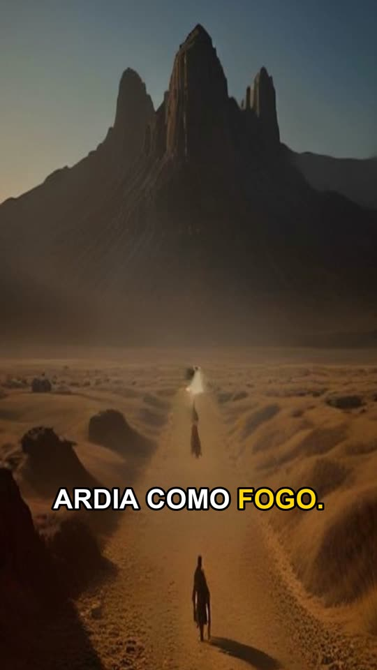
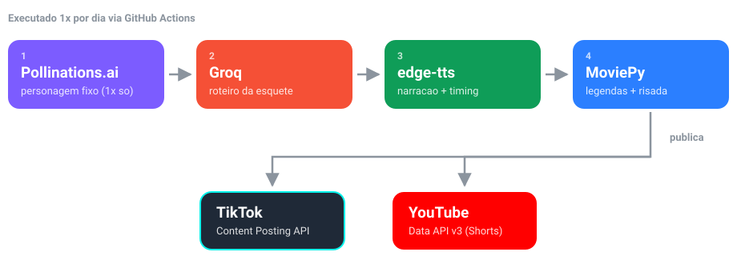

<div align="center">

# tiktok-ai-bot

**Uma esquete de humor por dia, gerada por IA e publicada sozinha no TikTok e no YouTube Shorts.**

Personagem 3D fixo e original, roteiro novo a cada dia, narracao com legendas animadas
e publicacao pelas APIs oficiais das duas plataformas, rodando de graca no GitHub Actions.

[](https://www.python.org/)
[](https://developers.tiktok.com/)
[](https://developers.google.com/youtube/v3)
[](https://github.com/features/actions)
[](https://ffmpeg.org/)

</div>

---

## Resultado

<table>
<tr>
<td width="46%" align="center">



</td>
<td width="54%">

**O que sai no final:**

+ Video vertical 1080x1920, pronto para Shorts e TikTok
+ Mesmo personagem em todos os videos, para o canal ter identidade
+ Legendas animadas palavra a palavra, no estilo CapCut
+ Risada de grupo fechando a piada
+ Narracao de 170 a 220 palavras, para passar de 1 minuto
+ Publicacao automatica nas duas plataformas

</td>
</tr>
</table>

## Como funciona

<div align="center">
  
</div>

| # | Ferramenta | O que faz |
|:--:|---|---|
| 1 |  | Gera a imagem do personagem. Roda uma unica vez e o arquivo fica commitado |
| 2 |  | Escreve o roteiro do dia: monologo, legenda e hashtags |
| 3 |  | Narra o texto e devolve o timing de cada palavra |
| 4 |  | Monta o video: zoom no personagem, legendas sincronizadas e risada final |
| 5 |  | Publica no TikTok |
| 6 |  | Publica no YouTube Shorts |

A mesma imagem do personagem (gerada uma unica vez e commitada em `assets/character.png`)
e reaproveitada em todo video, para manter sempre a mesma aparencia. As duas plataformas
sao independentes: os liga/desliga sao `tiktok.enabled` e `youtube.enabled` em
`config.yaml`, e se uma falhar ou nao estiver configurada, a outra continua normalmente.

Nada de scraping ou automacao de navegador: esse tipo de tecnica viola os Termos de
Servico das plataformas e coloca a conta em risco de banimento.

### Por que sem lip-sync (boca sincronizada)?

Assim o projeto se mantem gratuito. Um avatar com a boca sincronizada com a voz exige
servicos pagos (HeyGen, D-ID, Synthesia). Ha tambem um motivo de regras: a politica do
**TikTok Creator Rewards Program** exclui explicitamente "conteudo com sincronizacao
labial" da definicao de conteudo original elegivel para monetizacao. O formato atual
(narracao mais legenda, sem lip-sync) e o que melhor se encaixa nas regras vigentes.

## Sobre monetizacao

Vale saber antes de esperar renda do bot:

| Requisito do TikTok Creator Rewards | Situacao |
|---|---|
| Conta pessoal, 18 anos ou mais | Depende de voce |
| 10.000 seguidores | Depende de voce |
| 100.000 visualizacoes em 30 dias | Depende de voce |
| Video com pelo menos 1 minuto | Coberto: o roteiro pede 170 a 220 palavras e o bot regenera se vier curto |
| Conteudo original, sem lip-sync e sem marca d'agua de terceiros | Coberto: personagem proprio, sem lip-sync e a marca da Pollinations e removida |
| Rotular conteudo gerado por IA | Manual por enquanto: a Content Posting API ainda nao expoe esse campo |

O YouTube tem um programa equivalente (YouTube Partner Program), com seus proprios
requisitos de inscritos e horas assistidas, nao detalhados aqui.

## Limitacao importante do TikTok

Apps **nao auditados** pela TikTok so podem publicar com `privacy_level = SELF_ONLY`:
o video fica visivel apenas para a propria conta, como um rascunho, e nao aparece
publicamente no feed. Para publicar direto ao publico (`PUBLIC_TO_EVERYONE`), e
necessario solicitar auditoria do app no TikTok for Developers depois que ele estiver
funcionando (Manage Apps > seu app > Submit for Review). Essa e uma exigencia da
TikTok, nao uma limitacao deste bot.

O YouTube Shorts nao tem essa restricao: com o app OAuth do Google em publishing status
**"In production"**, os videos ja saem publicos direto (configuravel em
`youtube.privacy_status`).

O Kwai nao foi incluido porque a Kuaishou/Kwai nao oferece API publica de postagem para
desenvolvedores individuais fora de parcerias comerciais/MCN.

## Setup passo a passo

### 1. Crie o repositorio no GitHub

Suba esta pasta para um repositorio novo (pode ser privado).

### 2. Ative o GitHub Pages (necessario para o OAuth do TikTok)

O TikTok exige `redirect_uri` em HTTPS (nao aceita `localhost`). Este repo ja inclui
`docs/oauth-callback.html` pronto para isso.

- Settings > Pages > Source: `Deploy from a branch` > Branch: `main` / `docs`
- Sua URL de callback sera algo como: `https://SEU-USUARIO.github.io/SEU-REPO/oauth-callback.html`

### 3. Crie a chave gratuita da Groq

- Acesse [console.groq.com/keys](https://console.groq.com/keys) e clique em Create API Key
- Guarde o valor como `GROQ_API_KEY`

### 4. Gere a imagem do personagem (uma vez, e commite no repo)

```bash
pip install -r requirements.txt
python -m src.generate_character
git add assets/character.png
git commit -m "Gera personagem do canal"
git push
```

Isso fixa a aparencia do personagem definitivamente, porque o gerador de imagens
gratuito nao repete o mesmo rosto sozinho a cada chamada. Para trocar o visual, edite
`character.description` em `config.yaml` e rode novamente com `--force`.

### 5. Crie o app no TikTok for Developers

- Acesse [developers.tiktok.com/apps](https://developers.tiktok.com/apps) e clique em Create app
- Adicione o produto **Content Posting API** (e **Login Kit**)
- Em Login Kit > Redirect URI, cadastre a URL do passo 2
- Anote `Client key` e `Client secret`

### 6. Gere o primeiro refresh token (roda uma unica vez, na sua maquina)

```bash
python -m src.oauth_setup
```

O script pede `TIKTOK_CLIENT_KEY`, `TIKTOK_CLIENT_SECRET` e o `redirect_uri` do passo 2,
abre a URL de autorizacao (voce faz login com a conta do TikTok que vai postar) e pede
que voce cole o `code` que aparece na pagina de callback. No final ele imprime o
`TIKTOK_REFRESH_TOKEN`.

### 7. Crie um GitHub Personal Access Token

Esse token permite que o bot atualize sozinho o token do TikTok. O `refresh_token` do
TikTok muda a cada renovacao e o valor antigo e invalidado na hora, entao o bot precisa
salvar o novo valor via API do GitHub para continuar funcionando sem intervencao manual.
O refresh_token do YouTube nao precisa disso, porque o Google nao o rotaciona a cada uso.

- GitHub > Settings > Developer settings > Personal access tokens (classic)
- Escopo: `repo`
- Guarde o valor como `GH_PAT`

### 8. Crie o projeto no Google Cloud e o app do YouTube

- Acesse [console.cloud.google.com](https://console.cloud.google.com/) e crie um projeto novo
- Em APIs e servicos > Biblioteca, ative **"YouTube Data API v3"**
- Em APIs e servicos > Tela de consentimento OAuth:
  - Tipo de usuario: **External**
  - Escopo adicionado: `https://www.googleapis.com/auth/youtube.upload`
  - Publique o app (botao "Publish app", mudando de "Testing" para "In production").
    Isso e essencial: em "Testing" o refresh_token expira em 7 dias e o bot para de
    funcionar sozinho.
  - Como o escopo `youtube.upload` e sensivel, o Google pode mostrar um aviso de "app
    nao verificado" para quem faz login. Isso e normal para uso pessoal: basta clicar
    em Avancado > Acessar mesmo assim (voce mesmo e quem loga).
- Em APIs e servicos > Credenciais > Criar credenciais > ID do cliente OAuth, escolha o
  tipo **"App para computador" (Desktop app)**
- Anote o `Client ID` e o `Client secret`

### 9. Gere o refresh token do YouTube (roda uma unica vez, na sua maquina)

```bash
python -m src.youtube_oauth_setup
```

O script abre o navegador para voce fazer login com a conta do YouTube que vai receber
os Shorts, e no final imprime o `YOUTUBE_REFRESH_TOKEN`.

### 10. Cadastre os Secrets no repositorio

Em Settings > Secrets and variables > Actions > New repository secret:

| Secret | Origem |
|---|---|
| `GROQ_API_KEY` | passo 3 |
| `TIKTOK_CLIENT_KEY` | passo 5 |
| `TIKTOK_CLIENT_SECRET` | passo 5 |
| `TIKTOK_REFRESH_TOKEN` | passo 6 |
| `GH_PAT` | passo 7 |
| `YOUTUBE_CLIENT_ID` | passo 8 |
| `YOUTUBE_CLIENT_SECRET` | passo 8 |
| `YOUTUBE_REFRESH_TOKEN` | passo 9 |

Para usar apenas uma das duas plataformas, deixe os secrets da outra vazios e
desative-a em `config.yaml` (`tiktok.enabled: false` ou `youtube.enabled: false`).

### 11. Teste manualmente antes de deixar no automatico

Em Actions > Daily AI video post > Run workflow, rode primeiro com `dry_run: true`
(gera o video mas nao publica em nenhuma plataforma) e confira o artifact `video-*`
gerado. Depois rode com `dry_run: false` para publicar de verdade: o TikTok recebe o
video como privado/SELF_ONLY e o YouTube sai publico.

O cron ja esta configurado para rodar todo dia as 10h no horario de Brasilia.

## Customizacao

Tudo abaixo fica em `config.yaml`, com excecao da ultima linha.

| Opcao | Efeito |
|---|---|
| `character.name` / `character.description` | Definem o personagem. Rode `python -m src.generate_character --force` depois de mudar a descricao |
| `niche` | Define o tipo de causo/piada |
| `tts_voice` | Escolhe a voz da narracao. Rode `edge-tts --list-voices` para ver as opcoes |
| `script.model` | Modelo da Groq usado no roteiro. Confira a [pagina de modelos](https://console.groq.com/docs/models) antes de trocar, porque modelos sao descontinuados periodicamente |
| `script.min_narration_words` | Minimo de palavras da narracao. Abaixo disso o roteiro e gerado de novo, para o video passar de 1 minuto |
| `captions.words_per_chunk` | Quantas palavras aparecem por vez na legenda animada |
| `captions.bottom_margin` | Distancia da legenda ate a base do video, em px. O padrao (420) mantem o texto acima da interface do TikTok |
| `video.zoom_effect` | Liga/desliga o efeito de zoom (Ken Burns) |
| `sfx.laugh_enabled` / `sfx.laugh_gap_seconds` | Risada de grupo apos a narracao, sorteada entre os arquivos de `assets/laughs/` (licenca livre do Mixkit). Adicione seus proprios mp3 nessa pasta para variar |
| `hashtags_extra` | Hashtags fixas adicionadas em todo video |
| `tiktok.enabled` / `youtube.enabled` | Liga/desliga cada plataforma |
| `tiktok.privacy_level` | Mude para `PUBLIC_TO_EVERYONE` depois que o app for auditado pela TikTok |
| `src/script_gen.py` | Ajusta o prompt do roteiro: tom, formato, idioma |

## Rodando localmente

```bash
cp .env.example .env   # preencha os valores
pip install -r requirements.txt
export $(cat .env | xargs)   # ou use python-dotenv / direnv
DRY_RUN=true python main.py
```

Para testar so a parte de video (personagem, narracao, legendas e risada), sem gastar
chamada de LLM nem publicar nada:

```bash
python test_pipeline.py
```
